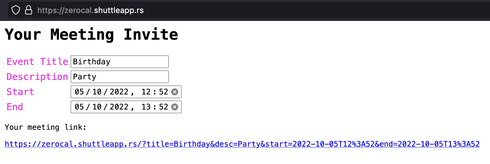

# zerocal 🚫📆

Welcome to zerocal, the *serverless calendar*.  
It allows you to create calendar invites from the convenience of your terminal!  
🔗 Here's my [blog post about the project](https://endler.dev/2022/zerocal/).

## Usage

```sh
curl https://zerocal.shuttleapp.rs?start=2022-11-04+20:00&duration=3h&title=Birthday&des
cription=paaarty > party.ics
open party.ics
```

## Web UI

You can also use the web UI at https://zerocal.shuttleapp.rs



## Contributing

Please check the issue tracker for contribution ideas. Any pull request is welcome. ❤️ 

## Credits

This app was built with the help of 🚀 [shuttle.rs](https://www.shuttle.rs/),
the web application platform for Rust. 
